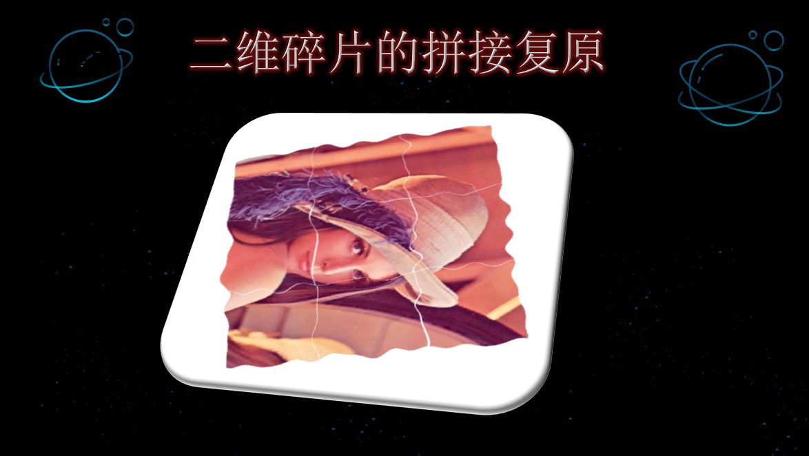
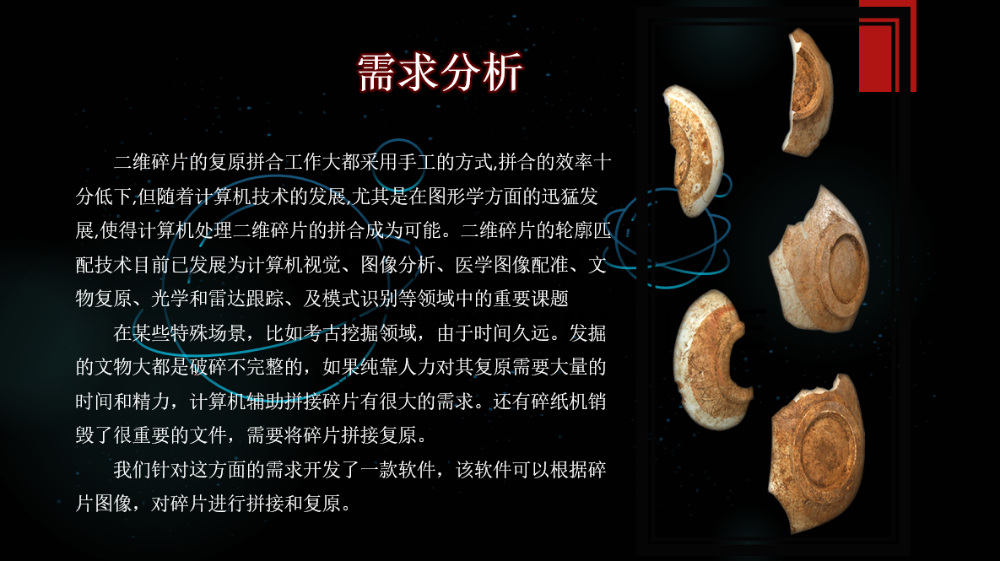
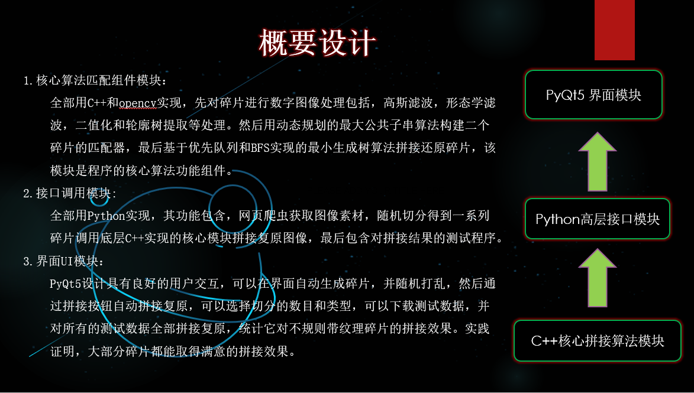
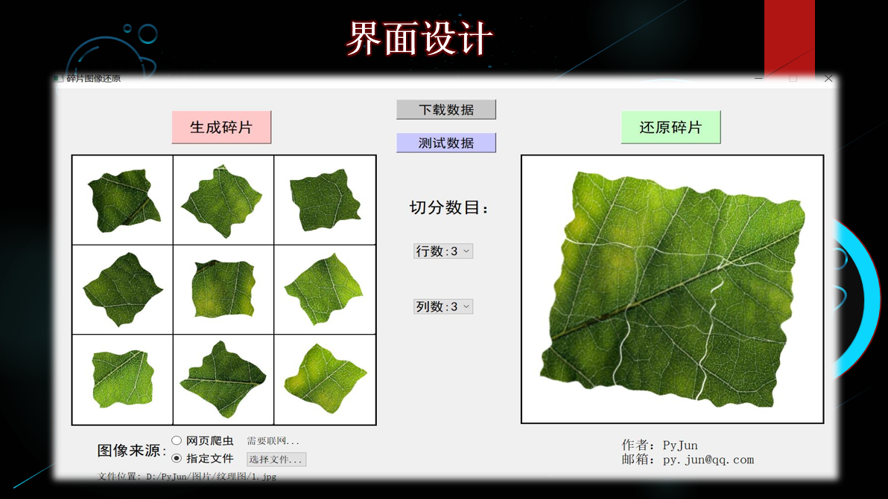
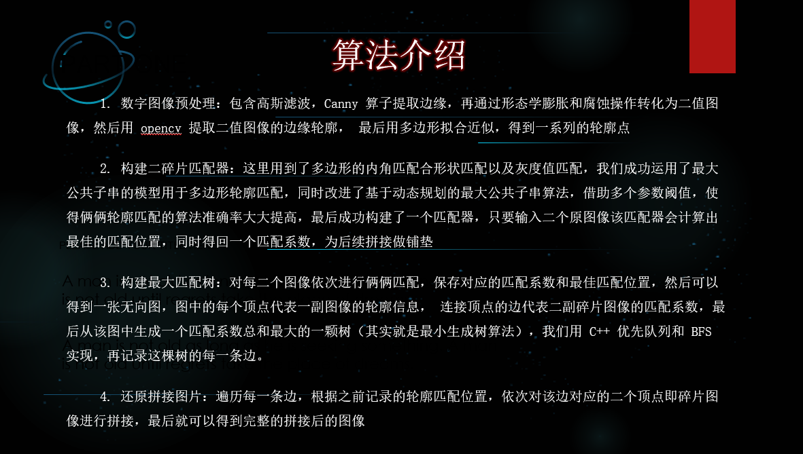
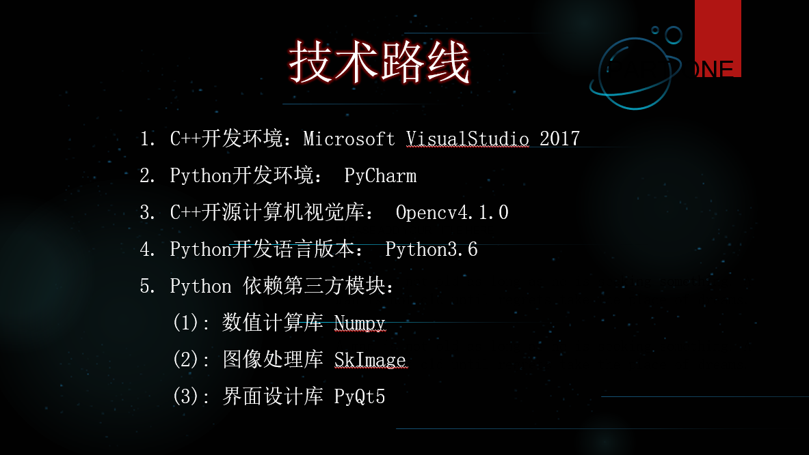
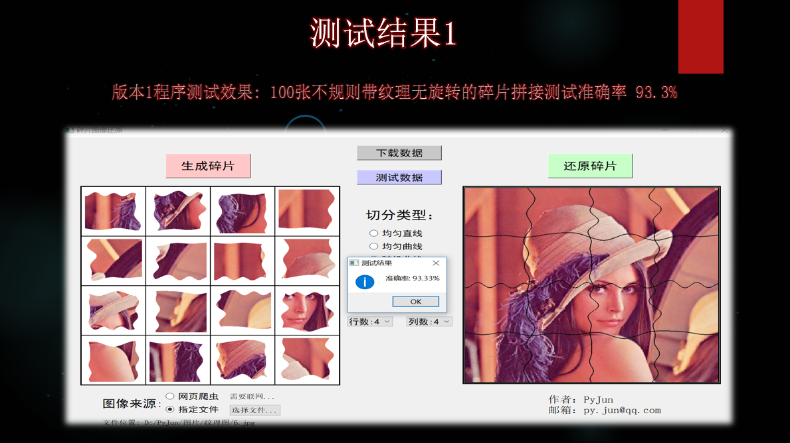
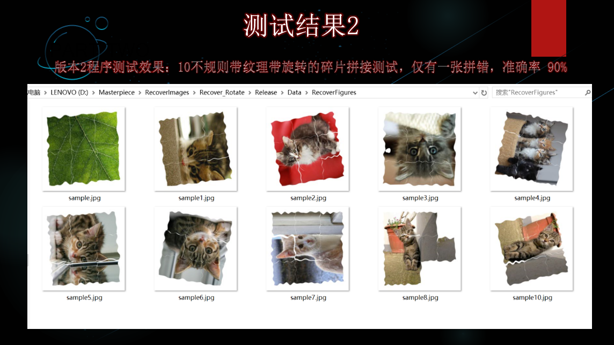

## 二维碎片拼接复原

#### 项目简介

1. 这是本人参加2019中国大学计算机设计大赛的作品，比赛已结束，故将项目开源
2. 该项目旨在对二维碎片拼接复原领域，诸如文物拼接提供一种可行的算法解决方案
3. 项目由Python和C++实现，C++用于底层的匹配拼接算法，Python用于数据处理，接口调用和UI交互
4. 具体的算法思路可以参考我的答辩PPT（或者项目展示）

#### 项目展示

